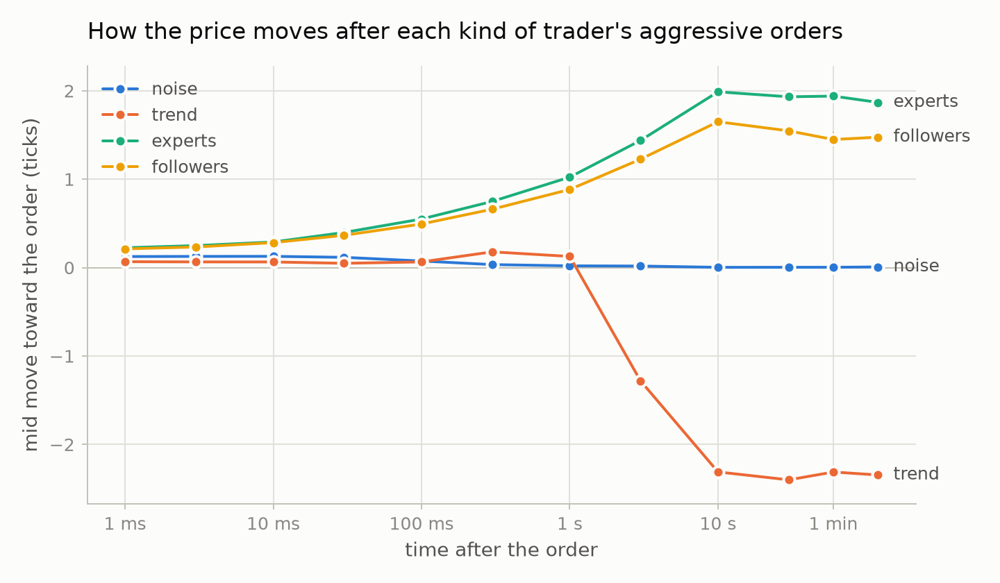

# crowdbook

An agent-based limit order book simulator in C++23: a research tool for market microstructure,
and a market you can trade in yourself, by hand or with your own bot, that shows you afterwards who
you traded with and what they knew.

crowdbook models a market as a crowd of individual traders — market makers, informed traders,
trend followers, noise traders — each sending orders to a simulated exchange over its own network
link. Spreads, depth, price impact and volatility are not assumed; they emerge from how the agents
interact. Writing your own agent means writing one C++ class and naming it in a scenario file,
or writing a program in any language that trades over the network.

> **Status:** the order book, the exchange, the simulation kernel, six built-in agents, scenario
> files, the `crowdbook` command and the Python analysis package are done, and
> [docs/results.md](docs/results.md) reports the experiments. You can trade in a market yourself, in
> real time, and replay the session exactly afterwards, and a server lets several people and bots
> trade in one market over the network, with a Python client for writing bots, in challenges that
> score them, and a report after each session shows who you traded with, what they knew and what the
> market would have done without you. A market with memory shows volatility clustering for about an
> hour, and brokers working large orders give order flow long memory and price impact whose shape
> depends on how long the book remembers. The engine is also a library, with versioned formats, a
> package to install and a container image. Markets can trade a whole day, with opening and closing
> auctions and halts, and a market can be a prediction market on a yes-or-no question, whose prices
> come out as probabilities. Nobody sees the true value exactly: traders see it late, each with
> errors of its own, and some with a tilt, which gives prediction markets the favourite–longshot
> bias of real ones. Next: calibration against real markets, starting with Polymarket's trades. See
> [docs/design.md](docs/design.md) for the goal, the architecture, the testing approach and the
> roadmap.

## Quick start

Requires CMake 3.25+, Ninja and a C++23 compiler (CI covers Apple clang and GCC 14).

```bash
cmake --workflow --preset dev
```

```bash
./build/dev/apps/crowdbook run examples/scenarios/market_maker.toml --log run.csv
```

```
examples/scenarios/market_maker.toml (seed 7): simulated 60s in 0.05s
1842 trades, 6338 lots traded, last price 9924

group                 agents   position           cash          pnl
maker                      1          0           1575        +1575
noise                     20          0          -1575        -1575
```

A market maker with a fast connection earns the spread from twenty zero-intelligence traders.
`run.csv` holds every order, cancel, fill, trade and top-of-book change. The same seed always
reproduces the same run, byte for byte, on any platform.
[examples/scenarios](examples/scenarios) has twelve scenarios, from this one to thousand-trader
markets with informed traders, memory, or brokers working large orders, a trading day and a
prediction market; [docs/scenarios.md](docs/scenarios.md) describes the file format and every
agent parameter.

## Results

A day of a 1,432-agent market — a thousand noise traders, two market makers, twenty trend
followers, and ten experts and four hundred followers who see the asset's true value late, each
with errors of its own — simulates in 35 seconds. Measured over four such days and thousands of
smaller markets ([docs/results.md](docs/results.md)):

- **Who moves prices.** Noise traders' orders move the mid a tenth of a tick, and the move is gone
  within a second. Orders from traders who follow the value move it one and a half to two ticks,
  for good. Trend followers' orders arrive as moves end, and the price reverses two ticks against
  them, which costs them 3.4 ticks on every lot.
- **Headcount is not what matters.** The same order flow from 100 or 1,000 noise traders gives the
  same market. Fat tails and volatility clustering appear only when agents react to the market.
- **Liquidity feedback makes volatility cluster.** When noise traders stand back from the book
  after prices jump, the thinner book makes the next jump bigger: volatility clusters for an hour
  or two, and one-minute returns have fat tails. A crowd of value traders who trade small
  mispricings undoes it: between them they are a deep book that does not thin.
- **Large orders leave two marks.** Brokers working parent orders with a Pareto tail of sizes give
  the signs of market orders the long memory that theory predicts from that tail. A parent's
  impact grows almost linearly with its size in a book that forgets in seconds, and bends toward
  the square root of real markets (an exponent of 0.6) when resting orders last 50 seconds.
- **Informed traders barely cost the market maker.** Its fills against them lose about 0.9 ticks
  per lot. But by pulling prices back to value they make its fills against noise traders worth
  one to two ticks more, and the noise traders pay for both.
- **Late traders give prediction markets a favourite–longshot bias.** In a market on a yes-or-no
  question, of the moments the price said 70 to 80 cents, three quarters resolved yes, but of
  those at 10 to 20, only 6%: traders who see the news a minute late hold prices back from 0 and
  100, as in real prediction and betting markets, and trend followers profit from the
  underreaction. Prices move fastest in the last minutes of questions still open, as on election
  night.
- **What's missing.** Volatility clusters for an hour, not the weeks of real markets, and nothing
  is calibrated to real order books yet.



The analysis is a separate Python package that drives the `crowdbook` command:

```bash
cmake --workflow --preset release
uv run --project analysis crowdbook-facts
uv run --project analysis crowdbook-experiments
uv run --project analysis crowdbook-large-orders
uv run --project analysis crowdbook-trading-day
uv run --project analysis crowdbook-prediction
```

## Trade in it yourself

`crowdbook play` runs a scenario in real time on a trading screen in the terminal, with you as
one more trader:

```bash
./build/release/apps/crowdbook play examples/scenarios/playable.toml --record session.toml
```

```
crowdbook  00:11.6 of 01:00.0  speed 5x  running
position +5  cash -50012  fees 1.0  pnl +4.5 at 10003.5

  your bids     bids    price     asks your asks
                        10008        46
                        10007        53
                        10006        64
                        10005        95
>                       10004        97         7
                   1    10003*
                  15    10002
                  50    10001
                  78    10000
                  53     9999

trades:  10003 x3 down  10004 x7 up  10004 x8 up  10004 x2 up  10004 x4 up
arrows price  m mid  b bid  s offer  B buy now  S sell now  size 7 (+/-)
c cancel here  C cancel all  [ ] speed  space pause  q quit
offer 7 at 10004
```

The arrow keys move the price you trade at. `b` and `s` bid and offer there, `B` and `S` buy and
sell at the market, and `c` and `C` cancel. `[` and `]` change the speed, and space pauses. Your
orders travel like everyone else's: a millisecond each way, under the exchange's position limits
and fees.

With `--record`, the session can be replayed exactly. The replay produces the same event log,
byte for byte, so a played session becomes data to analyse:

```bash
./build/release/apps/crowdbook replay session.toml --log session.csv
```

## Serve it to people and bots

`crowdbook serve` runs a market in real time for several traders at once, over TCP. Each seat is
one participant, with the scenario's account and latency, and anything that speaks the
[protocol](docs/protocol.md), JSON with one message per line, can claim it:

```bash
./build/release/apps/crowdbook serve examples/scenarios/playable.toml --seat alice --seat bob \
    --record session.toml
```

The clock starts once every seat is claimed. A person can trade from the terminal screen:

```bash
./build/release/apps/crowdbook connect 127.0.0.1:7878 --seat alice
```

and a program needs only a socket. In Python:

```python
import json, socket

conn = socket.create_connection(("127.0.0.1", 7878)).makefile("rw")
def send(message):
    conn.write(json.dumps(message) + "\n")
    conn.flush()

send({"type": "hello", "protocol": 1, "seat": "bob"})
send({"type": "new", "id": 1, "side": "buy", "order_type": "market", "quantity": 2})
for line in conn:
    print(json.loads(line))  # welcome, start, the order's events, trades, quotes...
```

The Python client in [clients/python](clients/python), standard library only, does the
bookkeeping: a bot overrides callbacks and acts through methods, much as an agent inside the
market does.

```python
import crowdbook

class DipBuyer(crowdbook.Bot):
    def on_trade(self, trade):
        if trade.price < self.settings.reference_price - 5 and self.ledger.position < 10:
            self.buy_market(1)

crowdbook.run(DipBuyer(), port=7878, seat="bob")
```

Clients name orders with their own ids and can cancel an order before it is acknowledged. A
dropped connection cancels its seat's orders. The server checks every message and limits how fast
each connection may send, and it listens only on 127.0.0.1 unless `--listen` says otherwise. The
recording replays the whole session, every seat's orders included, to the same event log byte for
byte.

## After the session: what you could not see

`crowdbook report` replays a recorded session and tells each seat what a real market never
would: who was on the other side of every fill, how far the true value was from the price when
they traded, and what the market would have done without you, by replaying it without your
orders.

```bash
./build/release/apps/crowdbook report examples/sessions/served_demo.toml --json report.json
```

```
seat alice: 23 fills, 42 lots
  traded with      type                fills  bought    sold   their edge   your markout
  noise            zero_intelligence      19      14      21        -1.05          +0.50
  informed         informed                3       6       0        +2.76              -
  bob              participant             1       0       1        -3.65              -
  pnl at the end +24.2, +33.0 at the true value (tick-lots, net of fees)
  without you: last price 10003 instead of 10003; you moved the mid +0.15 ticks on average
```

Alice made her money off the noise traders, and gave almost three ticks a lot to the informed
traders, who knew the true value when they traded with her. `play` and `serve` write the same
report at the end with `--report`. And any session can be rewound to a moment and played on
differently:

```bash
./build/release/apps/crowdbook play session.toml --at 2m --record retry.toml
```

## Challenges

A scenario can score whoever trades in it and brief them first. Five challenges come with the
project, each a market with a task:

| Challenge | Task | Scored on |
|---|---|---|
| [market_making.toml](examples/challenges/market_making.toml) | Be the only market maker among noise traders and traders who follow the true value | PnL at the true value, less a charge for inventory held; a loss of 2,000 stops you |
| [large_order.toml](examples/challenges/large_order.toml) | Buy 300 lots in ten minutes | Against the market's VWAP; unfinished lots cost 10 each |
| [news.toml](examples/challenges/news.toml) | Trade jumps in the true value you cannot see | PnL at the true value |
| [informed_flow.toml](examples/challenges/informed_flow.toml) | Make markets where two lots in five that take liquidity are informed | PnL at the true value, less a charge for inventory held |
| [prediction.toml](examples/challenges/prediction.toml) | Trade a yes-or-no question that resolves in ten minutes, without seeing the news | PnL at resolution, 100 or 0 a share |

```bash
./build/release/apps/crowdbook play examples/challenges/large_order.toml
```

The engine computes the score from the exchange's events, so replaying a session's recording
gives the same score, which anyone can check. The example bots play every challenge in CI.

## Writing an agent

An agent reacts to callbacks and acts through its context, which only lets it send requests to the
exchange and schedule wakeups:

```cpp
// Buys one lot when a trade prints more than `band` ticks below the recent average trade price,
// and sells one when a trade prints that far above it.
class MeanReverter final : public crowdbook::Agent {
public:
    MeanReverter(double band, crowdbook::Price referencePrice)
        : band_(band), average_(static_cast<double>(referencePrice)) {}

    void onTrade(crowdbook::AgentContext& context, const crowdbook::Trade& trade) override {
        const auto price = static_cast<double>(trade.price);
        if (price < average_ - band_) {
            context.submitMarket(crowdbook::Side::Buy, 1);
        } else if (price > average_ + band_) {
            context.submitMarket(crowdbook::Side::Sell, 1);
        }
        average_ += 0.05 * (price - average_);
    }

private:
    double band_;
    double average_;
};
```

Register it under a name, and any scenario can use it with `type = "mean_reverter"`:

```cpp
crowdbook::AgentRegistry registry = crowdbook::AgentRegistry::withBuiltIns();
registry.add("mean_reverter", [](const crowdbook::Parameters& parameters,
                                 const crowdbook::Environment& environment) {
    return std::make_unique<MeanReverter>(parameters.number("band", 3.0),
                                          environment.referencePrice);
});
```

[examples/custom_agent.cpp](examples/custom_agent.cpp) is the complete program, with a position
limit, and builds with the project.

## Use it as a library

Everything the `crowdbook` command does is a library call: run markets, serve them over your own
transport through the gateway, score and report on sessions. Install a build and
`find_package(crowdbook)`; [docs/library.md](docs/library.md) maps what to use for what, the
version numbers of the formats, the capacity per core, and the container image.

## Building

Each workflow preset configures, builds and runs the test suite, with output in `build/<preset>/`.

| Preset    | Build                                                      |
|-----------|------------------------------------------------------------|
| `dev`     | Debug                                                      |
| `release` | Release, including the benchmarks                          |
| `asan`    | Debug with AddressSanitizer and UndefinedBehaviorSanitizer |

The core library has no dependencies. `serve` waits on its sockets with epoll or kqueue, so it
needs Linux, macOS or a BSD; `connect` needs any POSIX system. Scenario files use
[toml++](https://github.com/marzer/tomlplusplus) and the tests use GoogleTest; CMake fetches both
at pinned versions, and [THIRD_PARTY_NOTICES.md](THIRD_PARTY_NOTICES.md) has toml++'s license,
since it is compiled into the `crowdbook` command. The analysis in `analysis/` is a
[uv](https://docs.astral.sh/uv/) project using polars, NumPy and matplotlib; nothing in the C++
build depends on it.

## Performance

Measured on one core of an Apple M5 with a Release build:

- The matching engine handles about 45 million operations per second (roughly 22 ns each) on a
  mixed stream of passive orders, cancels, crossing orders and market orders.
- A simulated day of the 1,432-agent mixed market in
  [large_market.toml](examples/scenarios/large_market.toml), 17.5 million trades, takes 35
  seconds: about 2,500 times faster than real time.
- The markets of the example challenges run 27,000 to 42,000 times faster than real time, and
  18,000 to 26,000 times when served through the gateway to a client that reads every message.
- The event log writes about 280 MB a second, and the server encodes a ten-level depth update in
  about 120 ns.
- Served over TCP to 50 trading clients, each placing or cancelling 20 orders a second and reading
  every market data message, the server answers within 0.15 ms of the market's own latency at the
  median and 0.48 ms at the 99th percentile, on 19% of a core. With 200 clients and market data
  batched every 10 ms, it is 0.18 and 1.2 ms on 31% of a core. A served market takes about 430 KB
  of memory.
- Whole markets of zero-intelligence traders, each acting about four times a second, simulate
  this many seconds per second of wall-clock time:

  | Traders | Every update pushed to every trader | Traders read the market on demand |
  |---:|---:|---:|
  | 100 | 1,051 | 11,665 |
  | 1,000 | 9.6 | 805 |
  | 10,000 | — | 54 |

  Pushing every trade and quote change to every trader costs N² as the crowd grows, so agents
  that only look at the market when they act read it on demand instead. Market makers, which
  react to every trade, still get the full stream.

Speed is guarded: tests count the heap allocations per request on the hot paths and fail CI if
they grow, and `tools/bench_check.py` compares every benchmark with a recorded baseline. To
reproduce:

```bash
cmake --workflow --preset release
./build/release/bench/crowdbook_bench
python3 tools/bench_check.py
```

## License

[MIT](LICENSE). Third-party code compiled into the binary is listed in
[THIRD_PARTY_NOTICES.md](THIRD_PARTY_NOTICES.md).
