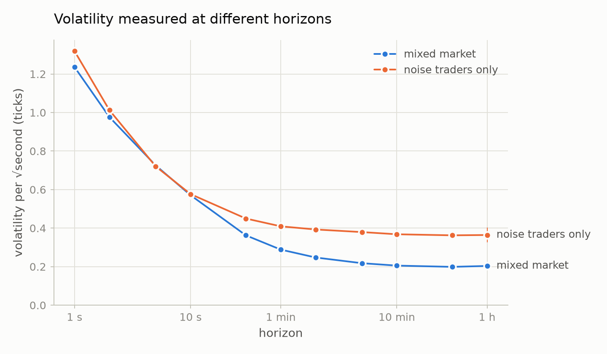
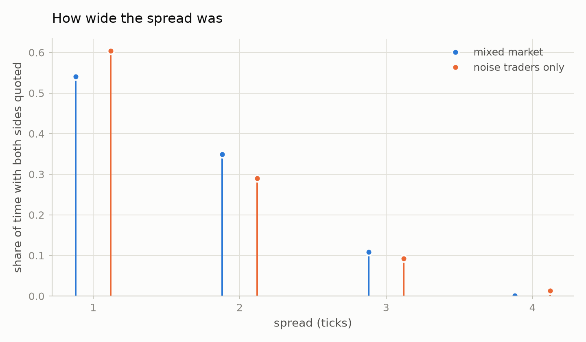
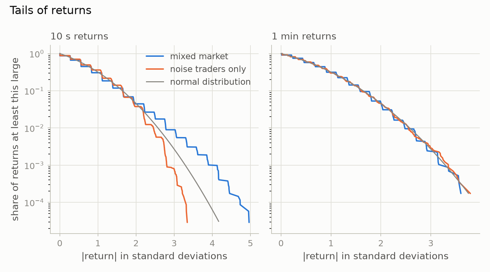
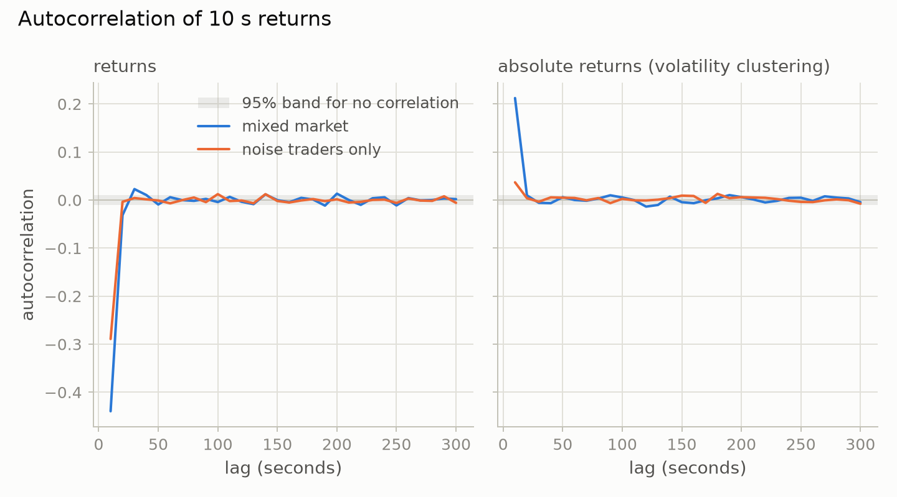
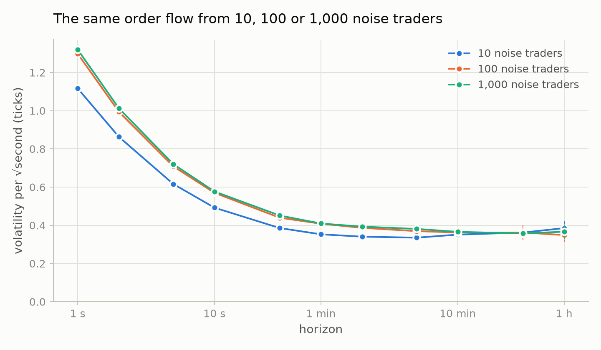
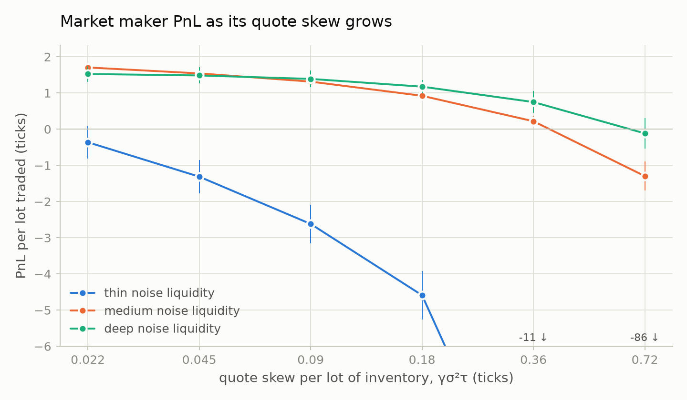
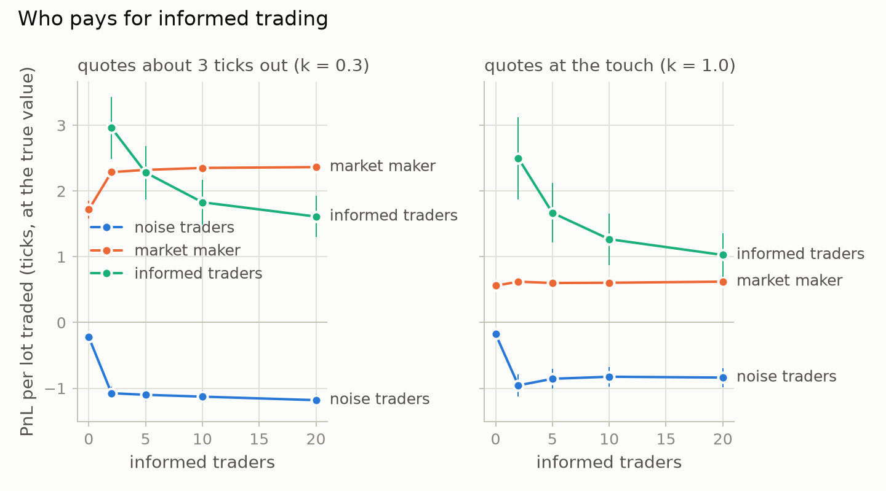

# Results

What the first experiments with crowdbook found. Every number and chart here comes from the two
scripts in [`analysis/`](../analysis), run against the Release build. Every run is seeded, so the
same commands reproduce them exactly:

```bash
cmake --workflow --preset release
uv run --project analysis crowdbook-facts        # about 5 minutes on 10 cores
uv run --project analysis crowdbook-experiments  # a few seconds
```

Uncertainties are standard errors across independent runs. Prices are in ticks, and PnL is in
ticks per lot traded.

## The markets

The stylized facts come from two markets built around the same thousand zero-intelligence traders
(Farmer, Patelli and Zovko, 2005). Each of those traders sends 0.4 limit orders and 0.1 market
orders a second, of 1 to 10 lots, on random sides. Each resting order is cancelled after an
exponential lifetime of 5 seconds on average.

- **Mixed market** ([large_market.toml](../examples/scenarios/large_market.toml)), with 1,041
  agents: the thousand noise traders, plus an Avellaneda–Stoikov market maker on a 20 µs
  connection, twenty trend followers, and twenty informed traders. The informed traders see the
  asset's true value with noise. That value is a random walk of 0.2 ticks per √second.
- **Noise traders only** ([large_noise.toml](../examples/scenarios/large_noise.toml)): the
  thousand noise traders on their own.

Each market ran for one simulated day under each of four seeds, sampling prices every second. It
also ran for one simulated hour under each seed with its event log, for spreads and price impact.
One simulated day of the mixed market is 17 million trades and takes 37 seconds on one core.

## What emerges

| Stylized fact of real markets (Cont, 2001) | Mixed market | Noise traders only |
|---|---|---|
| Tight spread | Yes: 1.58 ticks on average | Yes: 1.51 ticks |
| Mid price reverts at short horizons | Yes: lag-1 autocorrelation of 1 s returns is −0.38 | Yes: −0.41 |
| Returns uncorrelated beyond a few minutes | Not quite: −0.12 at 5 min, as the price is pulled back to value | Yes |
| Fat tails | Only around 10 s: excess kurtosis +0.86, gone by 1 min | No |
| Volatility clustering | Only around 10 s: absolute-return autocorrelation +0.21 at lag 1 | Barely: +0.04 |
| Price anchored to value at long horizons | Yes: volatility over an hour equals the true value's | No value to anchor to |
| Uninformed impact decays, informed impact stays | Yes | — |

Two facts of real markets are missing. Fat tails and volatility clustering appear here only over
seconds, and fade within a minute. Real markets show fat tails at intraday and daily horizons, and
volatility clustering that lasts for weeks (Cont, 2001). Every agent here acts at a constant
average rate, and none remembers more than a few seconds of prices. Nothing can make a busy hour
follow a busy hour.

### Prices bounce at short horizons



For a random walk, volatility per √second is the same at every horizon. Here it falls by a factor
of six in the mixed market, from 1.24 ticks at one second to 0.20 at an hour. The mechanism shows
in the [price impact](#who-moves-prices) below:
1. When a market order empties the best price level, the mid jumps.
2. Within a second, new limit orders land inside the widened spread and pull it back.

Real transaction prices give the same falling curve in a volatility signature plot (Andersen et
al., 2000), where the bid–ask bounce plays the part of the refilling book.

At long horizons the two markets part ways. The noise traders alone wander at 0.36 ticks per
√second. In the mixed market, the informed traders hold the price to the true value, so it settles
at the value's own 0.20.

| Market | Trades per second | Mean spread | Volatility at 1 s | 10 s | 1 min | 10 min | 1 h |
|---|---:|---:|---:|---:|---:|---:|---:|
| Mixed market | 200 | 1.58 | 1.24 | 0.57 | 0.29 | 0.21 | 0.20 ± 0.01 |
| Noise traders only | 181 | 1.51 | 1.32 | 0.58 | 0.41 | 0.37 | 0.36 ± 0.04 |



### Trend followers make bursts; informed traders anchor the price





| Market | Excess kurtosis, 10 s | Excess kurtosis, 1 min | Absolute-return autocorrelation, 10 s | Absolute-return autocorrelation, 1 min | Volatility at 1 h |
|---|---:|---:|---:|---:|---:|
| Mixed market | +0.86 ± 0.05 | −0.10 ± 0.04 | +0.212 ± 0.004 | +0.067 ± 0.010 | 0.20 ± 0.01 |
| … without the market maker | +0.73 ± 0.04 | −0.02 ± 0.07 | +0.248 ± 0.007 | +0.083 ± 0.015 | 0.20 ± 0.01 |
| … without the trend followers | −0.26 ± 0.02 | −0.15 ± 0.05 | +0.098 ± 0.005 | +0.021 ± 0.013 | 0.20 ± 0.01 |
| … without the informed traders | +0.55 ± 0.04 | −0.48 ± 0.02 | −0.136 ± 0.006 | +0.015 ± 0.009 | 0.36 ± 0.04 |
| Noise traders only | −0.31 ± 0.02 | −0.05 ± 0.07 | +0.037 ± 0.008 | +0.000 ± 0.027 | 0.36 ± 0.04 |

Leaving out one group at a time shows which agents shape the mixed market:

- **Trend followers** cause the fat tails and most of the clustering at 10 seconds. A move of a
  tick or so sets all twenty buying together, which extends the move and adds a burst of
  volatility. Without them, 10-second returns are thinner-tailed than normal, like the noise
  market's.
- **Informed traders** anchor the price. Without them, long-run volatility returns to the noise
  market's 0.36. The trend followers' runs then go uncorrected, and the market behaves strangely:
  one-minute returns are much thinner-tailed than normal (−0.48), and absolute returns are
  anti-correlated at 10 seconds. That regime deserves a closer look.
- **The market maker** changes little. It trades 63 lots a second, against 1,121 for the noise
  traders.

Even the mixed market's 10-second tails are mild. Real intraday returns are far more heavy-tailed,
with excess kurtosis often in the tens (Cont, 2001).

### Who makes money

| Trader | Lots traded per second | PnL per lot, positions at the true value |
|---|---:|---:|
| Market maker | 63.3 | +0.615 ± 0.006 |
| Noise traders | 1,121.2 | +0.064 ± 0.005 |
| Trend followers | 48.1 | −3.275 ± 0.009 |
| Informed traders | 33.8 | +1.39 ± 0.12 |

Trading is zero-sum, and the trend followers pay for everyone else. They lose 3.3 ticks on every
lot. That funds the informed traders and the market maker, and even leaves the noise traders
slightly ahead.

### Who moves prices


The chart measures how far the mid moves in an order's direction after it takes liquidity. The
averages run over four hours of the mixed market, with errors taken across the four runs.

| Trader | Aggressive orders | 1 ms | 100 ms | 1 s | 10 s | 1 min | 2 min |
|---|---:|---:|---:|---:|---:|---:|---:|
| Noise | 1,443,477 | +0.12 | +0.07 | +0.02 | +0.00 | +0.01 | +0.01 |
| Trend | 128,238 | +0.07 | +0.06 | +0.09 ± 0.03 | −2.17 ± 0.05 | −2.15 ± 0.09 | −2.19 ± 0.05 |
| Informed | 107,279 | +0.24 | +0.62 | +1.15 ± 0.01 | +2.03 ± 0.03 | +1.90 ± 0.03 | +1.87 ± 0.03 |

- **Noise orders** have purely transient impact. They move the mid a tenth of a tick, and the
  move is gone within a second.
- **Informed orders** have permanent impact. The mid keeps moving their way for ten seconds as
  the other informed traders reach the same conclusion, and stays there, about two ticks on.
- **Trend followers' orders** arrive as a move ends. Within ten seconds the price has gone two
  ticks against them, which is where their losses come from.

This is the textbook split between informed and uninformed flow (Kyle, 1985; Glosten and Milgrom,
1985). Here it comes out of the agents' behaviour; nothing in the model assumes it.

### Does the number of agents matter?



The same total flow (400 limit and 100 market orders a second) was split among 10, 100 or 1,000
noise traders, with unlimited positions, for four simulated days each:

| Noise traders | Orders per trader per second | Trades per second | Mean spread | Lag-1 autocorrelation at 1 s | Volatility at 1 s | Volatility at 10 min | Excess kurtosis at 1 min |
|---:|---:|---:|---:|---:|---:|---:|---:|
| 10 | 50 | 152.9 | 1.398 | −0.405 | 1.117 | 0.351 ± 0.015 | −0.13 ± 0.04 |
| 100 | 5 | 178.6 | 1.502 | −0.412 | 1.299 | 0.362 ± 0.010 | −0.18 ± 0.06 |
| 1,000 | 0.5 | 181.3 | 1.512 | −0.412 | 1.320 | 0.366 ± 0.011 | −0.05 ± 0.07 |

From 100 traders up, headcount makes almost no difference: spread and volatility agree within 2%.
Independent traders acting at random times add up to one random stream with the summed rate,
however the flow is divided.

With 10 traders, one difference appears, and it is mechanical: self-trade prevention. An agent's
market order meets its own resting order and is cancelled. A ten-minute run of each crowd (the
scenarios are in `stylized_facts.py`) with `--log-only trade,cancelled` counts 17 such
cancellations a second with 10 traders, 1.8 with 100 and 0.2 with 1,000. So 16% fewer trades
print, the spread is tighter and 1-second volatility is lower.

What makes market behaviour is what agents react to, not how many there are. The thousand
independent noise traders show no fat tails at all. Twenty trend followers reacting to the same
price do.

## Market-maker experiments

These use a smaller market, so many seeds are cheap. Each point averages 32 runs of 60 seconds.
Each run has twenty noise traders with one market order a second each, plus an Avellaneda–Stoikov
market maker (Avellaneda and Stoikov, 2008).

### Self-impact: skewing quotes moves the market



The noise traders anchor their limit prices on the best quotes, which are often the market
maker's own. When it skews its quotes against its inventory, it moves the market against itself.
PnL per lot falls as the skew per lot of inventory (γσ²τ) grows. It falls faster the less
liquidity the noise traders post themselves (0.5, 1 or 2 limit orders a second each):

| Skew per lot | Thin | Medium | Deep |
|---:|---:|---:|---:|
| 0.022 | −0.36 ± 0.45 | +1.70 ± 0.12 | +1.52 ± 0.22 |
| 0.045 | −1.31 ± 0.46 | +1.54 ± 0.09 | +1.48 ± 0.22 |
| 0.09 | −2.62 ± 0.54 | +1.31 ± 0.10 | +1.39 ± 0.23 |
| 0.18 | −4.59 ± 0.68 | +0.92 ± 0.12 | +1.17 ± 0.18 |
| 0.36 | −11.4 ± 3.7 | +0.22 ± 0.14 | +0.75 ± 0.30 |
| 0.72 | −86 ± 20 | −1.30 ± 0.40 | −0.12 ± 0.43 |

The default skew of 0.045 sits in the safe region for medium and deep markets. In a thin market
the maker loses at every skew: its own quotes are the market.

### Who pays for informed trading



The textbook expects informed traders to cost the market maker (Glosten and Milgrom, 1985). Here
its PnL per lot does not fall as informed traders are added. That holds whether it quotes wide
(intensity k = 0.3, about 3 ticks from its fair price) or at the touch (k = 1.0). The true value is
a random walk of 4 ticks per √second.

| Maker's quotes | Informed traders | Maker at 20 µs | Maker at 5 ms | Noise traders | Informed traders |
|---|---:|---:|---:|---:|---:|
| Wide | 0 | +1.72 ± 0.14 | +1.81 ± 0.14 | −0.22 ± 0.02 | — |
| Wide | 2 | +2.29 ± 0.03 | +2.26 ± 0.03 | −1.08 ± 0.10 | +2.96 ± 0.47 |
| Wide | 20 | +2.36 ± 0.03 | +2.25 ± 0.03 | −1.18 ± 0.09 | +1.61 ± 0.31 |
| At the touch | 0 | +0.56 ± 0.02 | +0.59 ± 0.02 | −0.18 ± 0.01 | — |
| At the touch | 2 | +0.62 ± 0.02 | +0.56 ± 0.02 | −0.96 ± 0.17 | +2.50 ± 0.62 |
| At the touch | 20 | +0.62 ± 0.01 | +0.47 ± 0.01 | −0.84 ± 0.15 | +1.03 ± 0.34 |

The maker is still adversely selected. The markouts below show how the mid moves in the maker's
favour after each of its fills, split by who took the other side, at a 20 µs connection:

| Maker's quotes | Informed traders | Other side | Share of maker's lots | 1 ms | 1 s | 10 s |
|---|---:|---|---:|---:|---:|---:|
| Wide | 0 | Noise | 100% | +2.33 | +1.94 ± 0.05 | +1.36 ± 0.15 |
| Wide | 20 | Informed | 23% | +2.67 | −0.99 ± 0.09 | −0.90 ± 0.32 |
| Wide | 20 | Noise | 77% | +2.86 | +3.33 ± 0.04 | +3.29 ± 0.09 |
| At the touch | 0 | Noise | 100% | +0.97 | +0.54 ± 0.02 | +0.51 ± 0.02 |
| At the touch | 20 | Informed | 37% | +0.97 | −0.85 ± 0.05 | −0.89 ± 0.17 |
| At the touch | 20 | Noise | 63% | +1.09 | +1.49 ± 0.03 | +1.45 ± 0.10 |

Within a second, the maker's fills against informed traders are losing about 0.9 ticks per lot.
But the same informed traders pull the price back to value after noise orders push it away. The
maker took the other side of those noise orders, so it collects that reversion. At the touch, its
fills against noise traders earn +1.45 a lot with informed traders around, against +0.51 without
them.

The two effects roughly cancel, and the informed traders more than double the maker's volume. The noise
traders pay for both. Glosten–Milgrom has a single liquidity provider. Here a crowd posts liquidity
too, and informed traders also correct the noise traders' mistakes.

Two smaller effects show in the table:
- A slow maker suffers a little more. At the touch on a 5 ms connection, its PnL per lot falls
  from +0.59 to +0.47 as informed traders are added; at 20 µs it does not fall.
- Informed traders compete away their own edge: profit per lot falls from 2.96 with two of them
  to 1.61 with twenty.

`crowdbook-experiments` prints the full tables, including the 500 µs latency and every count of
informed traders.

## What the analysis caught

Measuring the markets found four modelling problems, each fixed before the results above:

1. **Cancellation per trader.** Zero-intelligence traders first cancelled their own orders at a
   fixed rate per trader. The book grew without limit, from 4,500 to 12,500 resting orders in ten
   minutes, and the stale orders pinned the price for hours. Each order now has its own
   exponential lifetime, and the book holds steady near a thousand orders.
2. **Lockstep timers.** All twenty informed traders woke at exactly the same instants, so they hit
   the book as one burst five times a second. The impact measurement showed the price still moving
   within a millisecond of an informed order. Timers now start at a random point in their first
   interval.
3. **Informed traders out of capacity.** Holding the price to the true value means absorbing the
   noise traders' net order flow, which wanders like a random walk. With limits of 100 lots each,
   the informed traders filled up within half an hour. By the end of a day the price was up to 780
   ticks from the value. With those limits the mixed market showed fat tails at one minute (excess
   kurtosis +1.27 ± 0.30), but they were an artifact of the drifting price. With larger limits and a calmer
   value, they are gone.
4. **Idle agents.** Once the informed traders anchored the price, the trend followers' two-tick
   trends almost never formed, and the market maker's quotes, three ticks out, were almost never
   reached. Both were retuned until every type of agent trades. The settings are in the scenario
   file.

The fourth is a choice, not a bug. The results above hold for these settings, and other settings
give other markets. Making that easy to explore is the point of the toolkit.

## Limitations and next steps

- Agents act at constant rates, so fat tails and volatility clustering cannot outlast the slowest
  agent's memory. The next agents to add are ones whose activity reacts to the market: traders
  that act more after big moves, or that respond to news arriving at random times.
- Each scenario is one point in a large parameter space, chosen so that every type of agent
  trades. The scripts make sweeps cheap.
- One instrument, no fees or rebates, no hidden orders, and an exchange that takes no time to
  process a message.
- Impact and markouts are measured on the mid, so they miss changes in depth behind the best
  prices.

## References

- Andersen, T., Bollerslev, T., Diebold, F. and Labys, P. (2000). Great realizations. *Risk* 13,
  105–108.
- Avellaneda, M. and Stoikov, S. (2008). High-frequency trading in a limit order book.
  *Quantitative Finance* 8(3), 217–224.
- Cont, R. (2001). Empirical properties of asset returns: stylized facts and statistical issues.
  *Quantitative Finance* 1(2), 223–236.
- Farmer, J. D., Patelli, P. and Zovko, I. (2005). The predictive power of zero intelligence in
  financial markets. *PNAS* 102(6), 2254–2259.
- Glosten, L. and Milgrom, P. (1985). Bid, ask and transaction prices in a specialist market with
  heterogeneously informed traders. *Journal of Financial Economics* 14(1), 71–100.
- Kyle, A. (1985). Continuous auctions and insider trading. *Econometrica* 53(6), 1315–1335.
